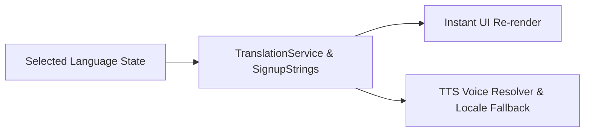

# 10 — Localization & Translation System

This document outlines the architecture of the dual-language translation system and the guidelines for expanding EasyLens to support new locales.

---

## 1. System Design

EasyLens uses a unified local translation model based on statically mapped key-value lookups, rather than relying on heavy external packages. This ensures zero-latency page builds, offline compatibility, and instant language switching.

### Translation Engines

#### 1. General App Translation Service (`TranslationService`)
The general translation engine is managed by [translation_service.dart](file:///Users/arronkianparejas/easylens/lib/services/translation_service.dart).
- **Language Map**: A static nested dictionary of keys mapping to target string values:
  ```dart
  static const Map<String, Map<String, String>> _localizedValues = {
    'en': {
      'welcome': 'Welcome to EasyLens',
      ...
    },
    'tl': {
      'welcome': 'Maligayang pagdating sa EasyLens',
      ...
    }
  };
  ```
- **Lookup Method**:
  ```dart
  static String translate(String key, String language)
  ```
  Returns the translated string. It defaults to the `'en'` variant if the key is missing or the selected language is not supported.

#### 2. Onboarding Signup Strings (`SignupStrings`)
The onboarding signup wizard is localized via [signup_strings.dart](file:///Users/arronkianparejas/easylens/lib/l10n/signup_strings.dart).
- Provides comprehensive English and Tagalog (Filipino) translations for all **18 onboarding steps**.
- Covers step headers, helper text, input hints, option cards (e.g. mobility aids, conditions), and navigation button labels.

---

## 2. Simplified Localization Pipeline



---

## 3. Text-to-Speech (TTS) Integration

Localization is wired directly into the TTS engine to ensure speech output matches the interface language:
1. **Language Map Selection**: When the user selects a language in `Settings` or `Signup`, the app updates the UI translations immediately.
2. **TTS Voice Fallback**: The `TtsService` maps the selected language code (e.g. `'Tagalog'` -> `'fil-PH'`). If the platform lacks native Tagalog voices (as is common on macOS/iOS simulator setups or certain Android ROMs), it dynamically falls back to `'en-US'` voice assets while continuing to read the text. This prevents voice engine crashes and ensures continuous speech feedback.

---

## 3. Step-by-Step: Adding a New Language

To introduce a new language (e.g., Spanish - `es`):

### Step 1: Add Translations in `TranslationService`
Open [translation_service.dart](file:///Users/arronkianparejas/easylens/lib/services/translation_service.dart) and add the translation dictionary matching all existing keys:
```dart
'es': {
  'welcome': 'Bienvenido a EasyLens',
  'stop': 'Deténgase inmediatamente',
  ...
}
```

### Step 2: Add Translations in `SignupStrings`
Open [signup_strings.dart](file:///Users/arronkianparejas/easylens/lib/l10n/signup_strings.dart) and provide translation maps for the onboarding step keys.

### Step 3: Register Language Code
Map the language name to its ISO-639-1 code (e.g. `'es'`) in `TranslationService.translate()`:
```dart
final code = language.toLowerCase().contains('espanol') || language.toLowerCase().contains('spanish') ? 'es' : ...
```

### Step 4: Register in TTS Service Language Code Map
Open [tts_service.dart](file:///Users/arronkianparejas/easylens/lib/services/tts_service.dart) and add the platform locale code in `_getLangCode()`:
```dart
case 'Spanish':
  return 'es-ES';
```

### Step 5: Add to Settings Selection Lists
Update the drop-down option lists in:
- Onboarding Signup Screen: [signup_screen.dart](file:///Users/arronkianparejas/easylens/lib/screens/signup/signup_screen.dart)
- User Preferences Screen: [preferences_screen.dart](file:///Users/arronkianparejas/easylens/lib/screens/settings/preferences_screen.dart)
