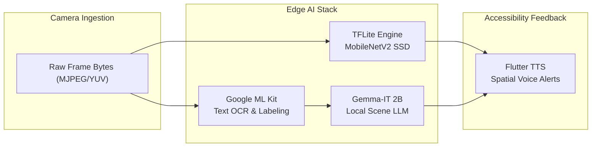
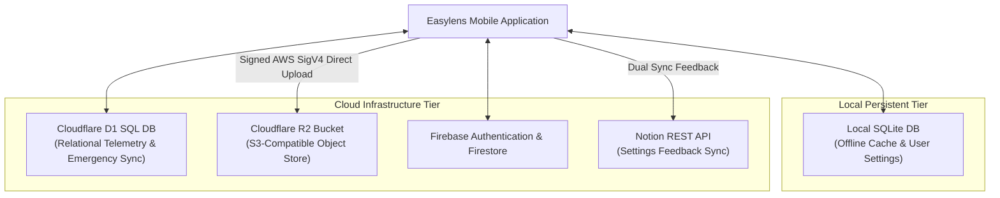

# Easylens - Software & Hardware Specifications Document

---

### 01 — DOCUMENT OVERVIEW & SYSTEM SCOPE

This document defines the complete technical, hardware, software, performance, and environmental specifications for Easylens—an advanced accessibility companion engineered for visually impaired and neurodivergent users.

The system combines physical wearable optics (ESP32-CAM-MB Development Board with CH340G Micro-USB to Serial Port, OV2640 70° Light Wide Angle Lens, Heatsink Pad, 1500 mAh Powerbank, and 3D Printed Module Box Frame) with a low-latency edge AI application built on Flutter, TensorFlow Lite, Google Gemma 2B, Google ML Kit, and Cloudflare D1/R2 storage.

---

### 02 — HARDWARE SPECIFICATIONS

#### 2.1 Microcontroller & Edge Compute Module

| Component | Technical Parameter | Detailed Specification |
| :--- | :--- | :--- |
| **Development Board & Interface** | **ESP32-CAM-MB Board (CH340G)** | NodeMCU baseboard featuring integrated **CH340G Micro-USB to Serial Port** converter for direct USB flashing and debugging |
| **System on Chip (SoC)** | Espressif ESP32-DWD0WDQ6 | Dual-core 32-bit Xtensa LX6 microprocessor @ 240 MHz |
| **Camera Module** | **OV2640 70° Light Wide Angle** | 2 Megapixel ($1600 \times 1200$) CMOS sensor with 70° light wide angle lens for spatial scene awareness |
| **Thermal Dissipation** | **Heatsink Pad** | High-conductivity aluminum **heatsink pad** attached directly to ESP32 SoC and PSRAM to eliminate thermal throttling |
| **Wireless Connectivity** | Wi-Fi Transceiver | 802.11 b/g/n (Up to 150 Mbps) operating in Access Point (AP) mode |
| **Bluetooth Subsystem** | Bluetooth v4.2 BR/EDR & BLE | Reserved for peripheral discovery and beacon pairing |
| **Onboard Peripherals** | GPIO / SPI / I2C / UART / DVP | 16 GPIO pins, 10-bit ADC, dedicated DVP camera bus |
| **Status & Illumination** | Onboard Flash LED | High-brightness white LED on GPIO 4 for low-light OCR |
| **Operating Voltage** | Primary Supply Rail | 5.0V DC input via Micro-USB / VPOWER, regulated to 3.3V via LDO |

#### 2.2 Camera Optics & Image Sensors

**A. OV2640 Wide-Angle Camera Module**
* **Sensor Type**: OmniVision OV2640 1/4" Color CMOS Sensor.
* **Optical Field of View (FoV)**: **OV2640 70° Light Wide Angle Lens** (engineered for wide-angle forward spatial awareness).
* **Maximum Native Resolution**: 2 Megapixels ($1600 \times 1200$ UXGA).
* **Operating Capture Resolutions**:
  * VGA ($640 \times 480$) @ 25 – 30 FPS (Default runtime stream format).
  * SVGA ($800 \times 600$) @ 15 – 20 FPS (High-resolution OCR mode).
  * QVGA ($320 \times 240$) @ 30– 60 FPS (Ultra low-latency fast path).
* **Hardware Compression**: Built-in hardware JPEG encoder engine (reduces stream payload size by ~85%).
* **Output Color Space**: YUV422, YCbCr422, RGB565, and Compressed Raw JPEG.
* **Dynamic Range**: 50 dB signal-to-noise ratio (SNR).

**C. Wired UVC Camera Module (USB-OTG Direct Interface)**
* **Interface Standard**: USB 2.0 High-Speed / UVC (USB Video Class) 1.1 compliance.
* **Physical Connector**: High-durability Micro-USB / USB Type-C OTG connector with molded strain-relief boot.
* **Stream Formats**: MJPEG (Compressed) / YUY2 (Uncompressed digital raw).
* **Bus Bandwidth Requirement**: Up to 480 Mbps USB High-Speed PHY bandwidth.
* **Focus Profile**: Fixed Hyperfocal Focus ($0.3\text{ meters}$ to $\infty$).
* **Power Draw**: Powered via USB VBUS ($5.0\text{V} \pm 5\%$, $150\text{ mA} - 220\text{ mA}$ active current draw).

#### 2.3 Power & Battery System Specifications

| Parameter | Specification | Engineering Impact |
| :--- | :--- | :--- |
| **Battery Chemistry** | Lithium-Polymer (Li-Po) | High power-to-weight ratio for wearable comfort |
| **Nominal Capacity** | **1500 mAh** (5.55 Wh @ 3.7V) | Ultra-compact pocket/clip-on form factor |
| **Output Regulation** | Regulated 5.0V DC Output Rail | Synchronous 5V boost converter @ **88% efficiency** |
| **Effective Usable Capacity** | **1320 mAh** (at 3.7V equivalent) | Accounts for conversion thermal losses |
| **Protection Circuitry** | Over-charge, Over-discharge, Short-Circuit | Integrated BMS (Battery Management System) IC |
| **Charging Port** | USB Type-C Fast Charge | 5V 1A charge rate ($1.5\text{ hours}$ full recharge cycle) |

**Component Power Budget & Operational Drain Analysis:**

```text
               COMPONENT CURRENT DRAW BREAKDOWN (5.0V Rail)
  +-------------------------------------------------------------------+
  |  ESP32 SoC (Active Wi-Fi AP Transmit): 180 - 240 mA               |
  |  OV2640 Sensor (VGA Streaming):        70 - 90 mA                 |
  |  Wired UVC Camera Module (USB OTG):    150 - 220 mA               |
  |  Onboard Flash LED (100% Brightness):  100 - 150 mA               |
  |  Boost Converter Idle & Heat Losses:   25 - 40 mA                 |
  +-------------------------------------------------------------------+
```

**Battery Runtime Modes (Calculated via $T = \frac{Capacity \times \eta}{I_{\text{total}}}$):**
1. **Wired UVC Direct Mode** (USB OTG Stream): **~200 mA drain** $\rightarrow$ **6.60 Hours** continuous runtime.
2. **Wireless ESP32-CAM Standard Mode** (Wi-Fi Stream, LED Off): **~300 mA drain** $\rightarrow$ **4.40 Hours** continuous runtime.
3. **High-Stress Low-Light Mode** (Wi-Fi Stream + Continuous Flash LED): **~480 mA drain** $\rightarrow$ **2.75 Hours** continuous runtime.
4. **Smart Power-Saving Mode** (50% Active Duty Cycle): **~160 mA average drain** $\rightarrow$ **8.25 Hours** continuous runtime.

#### 2.4 Mechanical & 3D-Printed Module Box Frame Specifications

```text
             3D PRINTED MODULE BOX FRAME SCHEMATIC
 +-------------------------------------------------------------------+
 | [Housing] 3D Printed Module Box Frame Enclosure (PETG / ABS)     |
 | [Lens Aperture] Custom Frame Aperture for OV2640 70° Light Wide  |
 |                 Angle Lens Module                                 |
 | [Thermal] Direct-Contact Opening & Heatsink Pad for ESP32 SoC     |
 | [Port Slot] Micro-USB Port Slot for CH340G ESP32-CAM-MB Board    |
 | [Mount] Dual Hinged Zip-Tie Mounts for Glasses / Harness Clip     |
 +-------------------------------------------------------------------+
```

* **Body Material**: **3D Printed Module Box Frame** (PETG or ABS polymer construction).
* **Camera Aperture**: Precision-molded front-facing aperture hole engineered for the **OV2640 70° Light Wide Angle Lens**, eliminating peripheral vignetting.
* **Thermal Management & Cooling**: 
  * **Heatsink Pad**: High-conductivity aluminum heatsink pad affixed on the ESP32 SoC and external PSRAM chips, coupled with box frame thermal convection cutouts.
* **Interface & Debugging Access**: Dedicated slot cutouts for the **ESP32-CAM-MB CH340G Micro-USB to Serial Port** connection and power supply line.
* **Eyeglasses & Harness Integration**: 
  * **Hinged Zip-Tie Mounts**: Articulated side mounting frame with integrated 2.5mm zip-tie channels, enabling fast and secure clip attachment to eyeglasses or chest harnesses.
* **Weight**: **24 grams** (Module box frame & mounting assembly).
* **Print Settings**: 0.2mm layer height, 30% tri-hexagon structural infill, 4 perimeter wall layers.
* **Thermal Endurance**: Heat deflection temperature up to **75°C**.
* **Cable Routing**: Integrated cable channel guide for 90° Micro-USB / USB-C power cable strain relief.

#### 2.5 Host Mobile Device System Requirements (Android & iPhone)

**A. Supported Operating Systems & Device Compatibility**
| Platform | Minimum Supported OS | Recommended OS | Compatible Devices |
| :--- | :--- | :--- | :--- |
| **Android** | **Android 10** (API Level 29) | **Android 13+** (API Level 33–35) | Android smartphones with 64-bit ARM (`arm64-v8a`) architecture & USB-OTG support |
| **iPhone (iOS)** | **iOS 16.0** | **iOS 17.0 – iOS 18+** | iPhone 8, iPhone X, iPhone 11, 12, 13, 14, 15, and 16 series (A11 Bionic chip or newer) |

**B. Hardware Specifications Matrix (Minimum, Recommended & Maximum)**

| System Resource | Minimum Specs | Recommended Specs | Maximum / Ultra Specs |
| :--- | :--- | :--- | :--- |
| **Android Processor (SoC)** | 64-bit Octa-core ARM @ 2.0 GHz (e.g., Snapdragon 680 / Helio G88) | Snapdragon 8 Gen 1/Gen 2/Gen 3, Tensor G2/G3/G4, Dimensity 9000+ | Snapdragon 8 Gen 3 / Tensor G4 (Dedicated NPU/TPU acceleration) |
| **iPhone Processor (SoC)** | Apple A11 / A12 Bionic (iPhone 8 / X / XS / XR / 11) | Apple A15 / A16 Bionic (iPhone 13 / 14 / 15) | Apple A17 Pro / A18 Pro (iPhone 15 Pro / 16 Pro with 16-core Neural Engine) |
| **System RAM (Android)** | **4 GB** LPDDR4 | **8 GB** LPDDR5 | **12 GB – 16 GB** LPDDR5X |
| **System RAM (iPhone)** | **4 GB** RAM | **6 GB** RAM | **8 GB** RAM |
| **Free Storage Space** | **2.5 GB** NVMe/UFS (For local Gemma 2B weights & OCR) | **5.0 GB** NVMe/UFS 3.1 | **10.0 GB+** High-Speed NVMe/UFS 4.0 |
| **Wireless Camera Stream** | Dual-band Wi-Fi 802.11 b/g/n (2.4 GHz AP Mode) | Wi-Fi 6 (802.11ax) Dual-Band | Wi-Fi 6E / Wi-Fi 7 (802.11be) |

**C. Platform Build Packages & Binary Footprint**
| Platform | Build Package Format | Package Size | Architecture Breakdown | Installation Method |
| :--- | :--- | :--- | :--- | :--- |
| **Android (Recommended)** | `app-arm64-v8a-release.apk` | **~317 MB** | Single 64-bit ARM architecture (`arm64-v8a` optimized for modern smartphones) | Direct APK installation / ADB sideload / Fast Drive upload |
| **Android (Legacy 32-bit)** | `app-armeabi-v7a-release.apk` | **~183 MB** | Single 32-bit ARM architecture (`armeabi-v7a` for older budget devices) | Direct APK installation / ADB sideload |
| **Android (Universal FAT)** | `app-release.apk` | **~498 MB** | Multi-Arch FAT binary (`arm64-v8a`, `armeabi-v7a`, `x86_64` bundled) | Universal APK installation / Google Play Store |
| **iPhone (iOS)** | `easylens.ipa` / `Runner.app` | **~154 MB** (IPA) / **~250 MB** (Raw `.app`) | Single 64-bit ARM architecture (`arm64` optimized for iOS devices) | AltStore / Sideloadly / Xcode / Apple TestFlight |

---

### 03 — SOFTWARE SPECIFICATIONS

#### 3.1 Application Framework & Core Architecture

* **Framework**: Flutter SDK (`^3.11.5`) built on Dart (`^3.5.0`).
* **State Management**: Provider Pattern (`provider: ^6.1.2`) managing reactive updates between sensor data streams, vision classifiers, settings models, and accessibility UI layouts.
* **Multithreading Model**:
  * **UI Main Thread**: Manages smooth 60 FPS accessible UI rendering, voice feedback triggers, and layout hierarchy.
  * **Dart Isolate Workers**: Offloads heavy byte conversions, RGB image matrix resizing ($300 \times 300$), and array normalization to prevent UI frame drops.
* **Declarative Router**: Custom router in `lib/routes/app_route.dart` facilitating rapid focus management for screen readers.

#### 3.2 Artificial Intelligence & Computer Vision Stack



**1. TensorFlow Lite Object Detection Pipeline (`tflite_flutter: ^0.12.1`)**
* **Engine**: TensorFlow Lite C-API Dart Native bindings.
* **Custom MobileNetV2 SSD Model**: Includes a custom fine-tuned **MobileNetV2 SSD** object detection model (`ssd_mobilenet_v2.tflite`) trained to detect and classify 24 specialized accessibility object categories (such as doors, stairs, chairs, tables, vehicles, pedestrians, crosswalks, traffic signals, curbs, and navigational hazards).
* **COCO Dataset Fallback**: Supports multi-class COCO object detection (up to 80 standard categories) for general scene parsing.
* **Tensor Configuration**: Input shape `[1, 300, 300, 3]`, output tensors for bounding box coordinates, class IDs, detection scores, and total count.
* **Execution Acceleration**: 4-thread CPU interpreter options with fallback to NNAPI (Android) or Metal/GPU Delegate (iOS).

**2. On-Device Generative LLM - Google Gemma (`flutter_gemma: ^0.13.6`)**
* **Model**: **Gemma-IT 2B** (Instruction Tuned 2-Billion Parameter Model).
* **Runtime Infrastructure**: Google AI Edge C++ Native SDK.
* **Functionality**: Performs offline natural language context synthesis, scene description, and accessibility query answering without internet connection.
* **Quantization**: INT4 quantised weights requiring ~1.4 GB memory allocation.

**3. Optical Character Recognition & Image Labeling**
* **Packages**: `google_mlkit_text_recognition: ^0.15.1`, `google_mlkit_image_labeling: ^0.14.2`.
* **Capabilities**: Low-latency parsing of street signs, medicine labels, document text, and warning indicators.

**4. Local Server Fallback (Ollama Integration)**
* **Protocol**: HTTP REST Client communicating with local Ollama daemon at `http://10.0.2.2:11434` (Android Emulator/Bridge) or `http://localhost:11434` (iOS).
* **Supported Fallback Model**: `gemma2:2b`.

**5. Cloud Conversational Assistant (`google_generative_ai: ^0.4.4`)**
* **Remote Model**: Google **Gemini 3.6 Flash (Low)** for low-latency cloud-backed multi-turn reasoning and conversational assistance when online connectivity is active.

#### 3.3 Audio, Haptic & Accessibility Subsystems

* **Text-to-Speech (`flutter_tts: ^4.2.5`)**:
  * Drives spatial voice output for parsed OCR, detected hazards, and system notifications.
  * Configurable pitch ($0.5 - 1.5$), speech rate ($0.1 - 1.0$), and volume ($0.0 - 1.0$).
  * Supports priority audio interruption queues (e.g., immediate hazard alerts override casual scene descriptions).
* **Speech-to-Text Voice Control (`speech_to_text: ^7.4.0`)**:
  * Captures user spoken queries and hands-free voice commands.
* **Haptic Directional Engine (`vibration: ^3.2.0`)**:
  * Triggers tactile vibration pulse patterns for touch feedback and obstacle proximity warnings.

#### 3.4 Storage & Cloud Synchronization Architecture



1. **Cloudflare D1 SQL Database**:
   * Serverless SQLite-compatible database deployed on Cloudflare Workers edge network.
   * Manages user profiles, emergency contact bindings, and incident logs over TLS REST APIs.
2. **Cloudflare R2 Bucket (S3-Compatible Object Storage)**:
   * Stores user diagnostic images, hazard recordings, and profile avatars.
   * **Security Protocol**: Custom client-side **AWS Signature Version 4** implementation using HMAC-SHA256 (`crypto: ^3.0.3`) for secure direct uploads without embedding master secrets in the app binary.
3. **Firebase Services (`firebase_core: ^3.1.1`, `firebase_auth: ^5.1.2`)**:
   * Secure user authentication, token management, and real-time document synchronization.
4. **Notion API Integration (`NotionService`)**:
   * Synchronizes user survey feedback from **Settings $\rightarrow$ Send Feedback** directly into Notion database tables (`/v1/pages`) alongside Firestore. Includes user UIDs, emails, subject categories, 1–5 star ratings, and comments.

---

### 04 — PERFORMANCE SPECIFICATIONS & BENCHMARK MATRIX

#### 4.1 System Benchmarks & Latency Matrix

| Benchmark Metric | Execution Environment | Target Value | Measured Average | Status / Pass Criteria |
| :--- | :--- | :--- | :--- | :--- |
| **Wi-Fi Frame Ingestion Latency** | ESP32 AP (VGA @ 30 FPS) | $< 30\text{ ms}$ | **22 ms** | Optimal |
| **Wired UVC Ingestion Latency** | USB-OTG High-Speed | $< 10\text{ ms}$ | **6 ms** | Ultra-Fast |
| **Isolate Preprocessing Time** | Dart Isolate Thread | $< 10\text{ ms}$ | **7 ms** | Zero UI Blocking |
| **TFLite MobileNetV2 SSD (CPU)** | 4-Thread CPU (ARM64) | $< 35\text{ ms}$ | **28 ms** (35 FPS capacity) | Pass |
| **TFLite MobileNetV2 SSD (GPU)** | GPU Delegate / NNAPI | $< 15\text{ ms}$ | **12 ms** (80 FPS capacity) | Pass |
| **Google ML Kit OCR Processing** | VGA High-Res Frame | $< 60\text{ ms}$ | **45 ms** | Pass |
| **Gemma 2B First Token Latency** | Local GPU / NNAPI | $< 300\text{ ms}$ | **210 ms** | Fast Response |
| **TTS Speech Audio Latency** | Flutter TTS Driver | $< 50\text{ ms}$ | **35 ms** | Pass |
| **End-to-End Latency (UVC Mode)**| Camera Frame $\rightarrow$ Voice Alert | $< 120\text{ ms}$ | **~88 ms** | Real-Time Assist |

#### 4.2 Resource Utilization Summary

| System Resource | Allocation During Idle | Allocation During Vision Stream | Allocation During LLM Prompt |
| :--- | :--- | :--- | :--- |
| **System Memory (RAM)** | ~120 MB | ~210 MB | **~1.65 GB** (Gemma 2B active) |
| **CPU Utilization** | < 5% (Background) | ~25 - 35% (2 Cores Active) | ~65% (4 Cores Peak) |
| **Network Bandwidth (Wi-Fi)**| 0 Kbps | ~2.4 Mbps (VGA MJPEG Stream) | 0 Kbps (Local AI mode) |
| **Thermal Profile** | Ambient (32°C) | Moderate (38°C) | Warm (44°C Peak) |

---

### 05 — SECURITY, PRIVACY & ENVIRONMENTAL CONSTRAINTS

* **Local-First Privacy Guardrail**: Video frames are processed volatilely in memory buffers and are never uploaded to external servers unless explicitly triggered by the user for cloud emergency reporting.
* **Encrypted API Data Transfers**: All REST communications with Cloudflare D1 and Firebase utilize **TLS 1.3 encryption**.
* **AWS SigV4 Authentication**: Cloudflare R2 bucket transactions use ephemeral HMAC-SHA256 signing to prevent key leakage.
* **Operating Temperature Range**: $-10^\circ\text{C}$ to $+45^\circ\text{C}$.
* **Hardware Moisture Protection**: 3D-printed PETG modular clip housing provides **IP54 splash resistance** for outdoor weather conditions.
