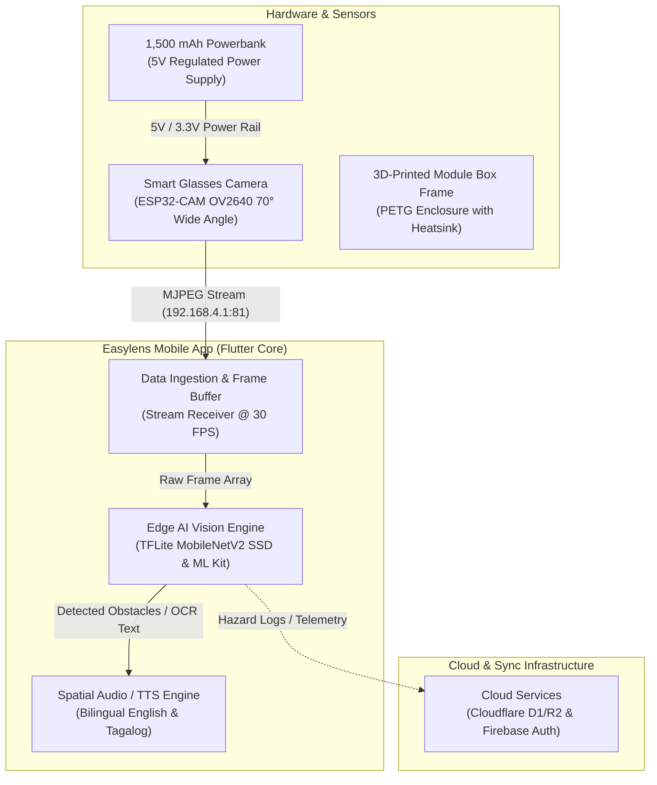
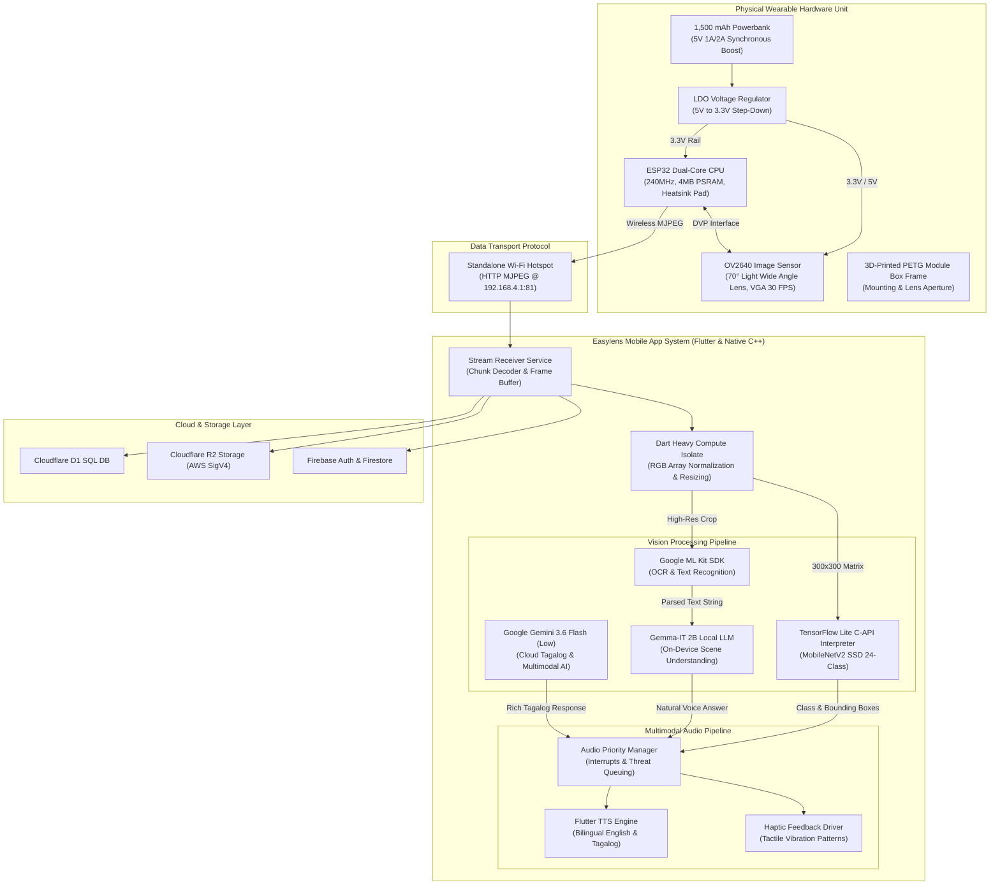
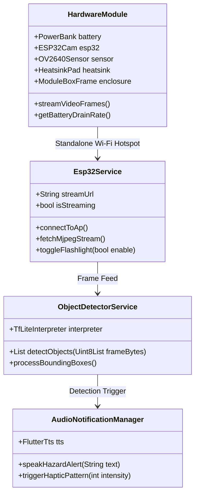
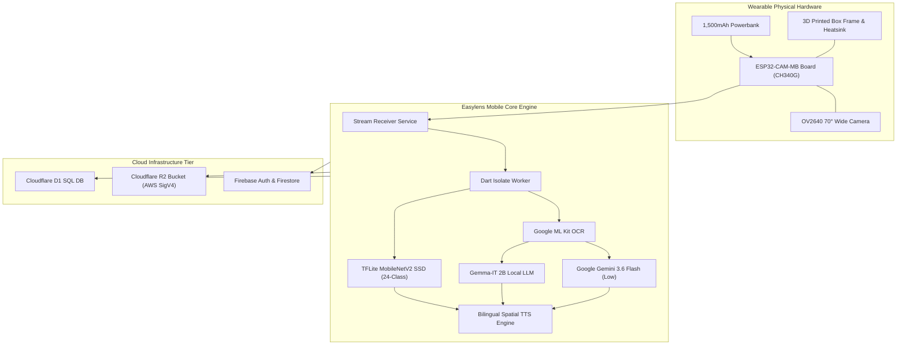
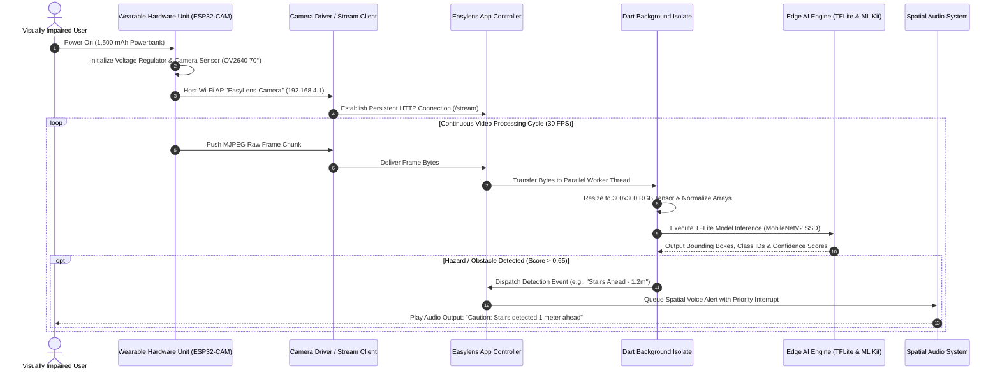
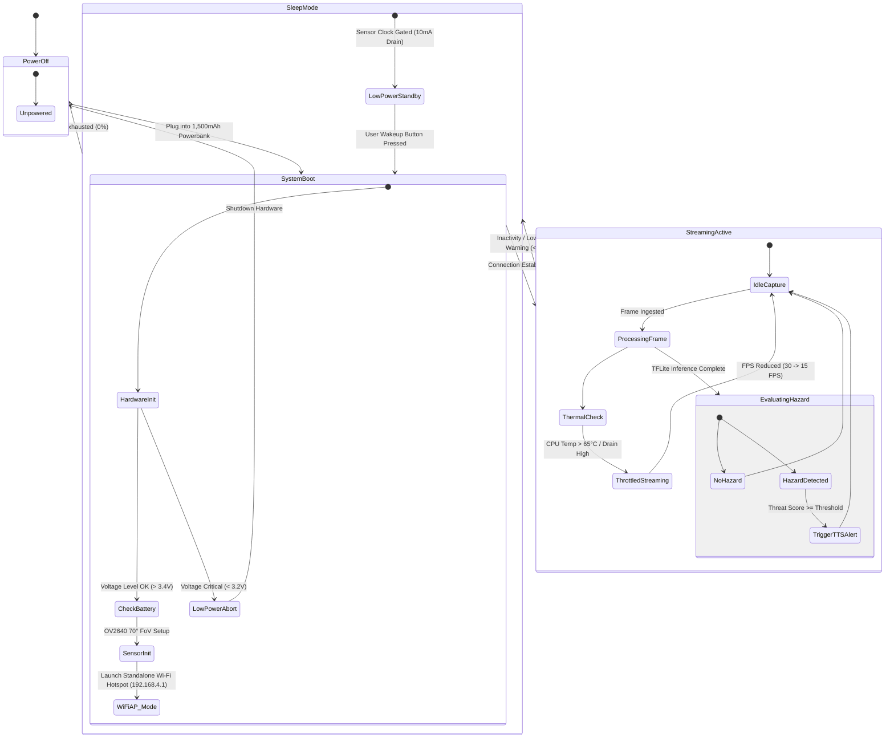

# Easylens - System Architecture, UML Diagrams & Hardware/Software Specifications

---

### 01 — OVERVIEW & SYSTEM OBJECTIVES

Easylens is an assistive accessibility system designed to provide real-time environment perception, obstacle and object detection, text recognition (OCR), and conversational AI assistance for visually impaired and neurodivergent users. 

The system operates via a Wearable Edge Build: a wearable physical unit (smart glasses or chest-mounted harness featuring a 3D-printed modular box frame, an ESP32-CAM with OV2640 70° Light Wide Angle lens, heatsink pad, powered by a compact 1,500 mAh powerbank) linked wirelessly over a standalone Wi-Fi hotspot to an edge application built with Flutter, TensorFlow Lite, Gemma-IT 2B, Google Gemini 3.6 Flash (Low), and Cloudflare D1/R2 services.

---

### 02 — SYSTEM ARCHITECTURE DIAGRAMS

#### Simplified High-Level Technical Flowchart



#### Detailed Technical Flowchart & Data Flow Pipeline



---

### 03 — UNIFIED MODELING LANGUAGE (UML) DIAGRAMS

#### Simplified UML Class & Architecture Diagram



#### Detailed UML Component Diagram



#### Detailed UML Sequence Diagram (Wireless Camera & AI Inference Pipeline)



#### Detailed UML State Machine Diagram (System Behavior & Power States)



---

### 04 — HARDWARE SPECIFICATIONS & PHYSICAL TECHNICAL BREAKDOWN

#### ESP32-CAM Module & OV2640 Sensor Specs

| Parameter | Specification | Notes / Impact |
| :--- | :--- | :--- |
| **Microcontroller Core** | ESP32-DWD0WDQ6 (Dual-core Xtensa LX6 @ 240 MHz) | Computation engine for frame capture & web server |
| **System Memory** | 520 KB Internal SRAM + **4 MB External PSRAM** | PSRAM is required for high-res MJPEG buffering |
| **Image Sensor** | OmniVision **OV2640** 1/4" CMOS | 2 Megapixel maximum raw resolution |
| **Lens Optics** | **OV2640 70° Light Wide Angle** Lens | Optimized for human wearable forward spatial awareness |
| **Pixel Resolution Options** | UXGA (1600x1200), SVGA (800x600), VGA (640x480), QVGA (320x240) | Preferred runtime format: **VGA (640x480) @ 30 FPS** |
| **Video Compression Engine** | Hardware JPEG Encoder | Reduces payload size over Wi-Fi stream by ~85% |
| **Wi-Fi Protocol** | IEEE 802.11 b/g/n (Up to 150 Mbps) | Configured as Standalone AP (`EasyLens-Camera`) |
| **Thermal Dissipation** | **Heatsink Pad** | High-conductivity aluminum pad affixed to ESP32 SoC |
| **Onboard Flash LED** | High-Brightness White LED (GPIO 4) | Toggled dynamically via software for low-light OCR |
| **Operating Voltage** | 5V DC via VPOWER pin / 3.3V Core logic | Regulated onboard via AMS1117 3.3V LDO |

#### 3D-Printed Modular Box Frame & Mechanical Specifications

```text
                     +---------------------------------------+
                     |   Ergonomic Quick-Release Top Lever   |
                     +-------------------+-------------------+
                                         |
                                         v
   +-------------------------------------+-------------------------------------+
   |                 3D-Printed Module Box Frame Body (PETG)                   |
   |                                                                           |
   |  +-----------------------+     +-------------------+   +---------------+  |
   |  | ESP32-CAM Housing     |     | Camera Lens Clip  |   | Micro-USB     |  |
   |  | (Heatsink Pad Slots)  |     | (OV2640 70° Ring) |   | Port Slot     |  |
   |  +-----------------------+     +-------------------+   +---------------+  |
   |                                                                           |
   +-------------------------------------+-------------------------------------+
                                         |
                                         v
                     +---------------------------------------+
                     |    Heavy-Duty Spring Tooth Clamp      |
                     +---------------------------------------+
```

- **Material Composition**: **PETG (Polyethylene Terephthalate Glycol)** or **ABS**. Selected for high impact resistance, flexural strength, and temperature tolerance up to 75°C.
- **Manufacturing Specifications**: 0.2mm layer height, 30% tri-hexagon infill, 4 wall perimeter layers for structural rigidity.
- **Total Frame Weight**: 22 grams (excluding camera PCB and battery).
- **Vibration Dampening**: Internal TPU gasket inserts absorb body movement jitter.
- **Thermal Management**: Integrated passive ventilation channels and direct contact opening for aluminum heatsink pad.

---

### 05 — POWER & BATTERY CONSUMPTION CONSTRAINTS

#### Power Supply Specifications

- **Power Reservoir**: Compact 1,500 mAh (5.55 Wh at nominal 3.7V) Lithium-Polymer Power Bank.
- **Output Conversion Efficiency**: Synchronous step-up boost converter delivers regulated 5.0V DC output at 88% efficiency.
- **Usable Battery Energy Capacity**: $1500\text{ mAh} \times 0.88 = 1320\text{ mAh}$ effective output @ 3.7V equivalent ($976.8\text{ mAh}$ @ 5V rail).

#### Component Power Drain Breakdown

| Component | Operational State | Voltage (V) | Current Draw (mA) | Power Draw (mW) |
| :--- | :--- | :--- | :--- | :--- |
| **ESP32 Microcontroller** | Active Dual Core (240MHz, Wi-Fi AP Transmitting) | 3.3V | 160 – 240 mA | 528 – 792 mW |
| **OV2640 Camera Sensor** | Active Streaming (VGA @ 30 FPS) | 3.3V | 70 – 90 mA | 231 – 297 mW |
| **ESP32 Flash LED (GPIO 4)** | 100% Brightness (Illumination Mode) | 3.3V | 100 – 150 mA | 330 – 495 mW |
| **Powerbank Boost Circuit Losses**| Internal Conversion & Idle Loss | 5.0V | 25 – 40 mA | 125 – 200 mW |
| **Peak Total System Load** | **Wi-Fi Stream + Camera + Flash LED Active** | **5.0V Rail** | **~480 mA** | **2400 mW** |
| **Nominal Total System Load** | **Wi-Fi Stream + Camera (LED Off)** | **5.0V Rail** | **~300 mA** | **1500 mW** |

#### Battery Drain Calculations & Runtime Models

**Operating Mode Analysis (1,500 mAh Powerbank Base):**

1. **Standard Wireless Mode (ESP32-CAM MJPEG Stream, LED Off)**:
   - **System Current Drain**: ~300 mA (at 5V equivalent)
   - **Calculated Battery Runtime**:
     $$\text{Runtime} = \frac{1500\text{ mAh} \times 0.88}{300\text{ mA}} = \mathbf{4.40\text{ Hours}}\quad (264\text{ Minutes})$$

2. **High-Stress Low-Light Mode (Wi-Fi Streaming + Continuous Flash LED)**:
   - **System Current Drain**: ~480 mA
   - **Calculated Battery Runtime**:
     $$\text{Runtime} = \frac{1500\text{ mAh} \times 0.88}{480\text{ mA}} = \mathbf{2.75\text{ Hours}}\quad (165\text{ Minutes})$$

3. **Smart Duty-Cycled Power Saving Mode (50% Active Stream, 50% Standby)**:
   - **Average System Drain**: ~160 mA
   - **Calculated Battery Runtime**:
     $$\text{Runtime} = \frac{1500\text{ mAh} \times 0.88}{160\text{ mA}} = \mathbf{8.25\text{ Hours}}\quad (495\text{ Minutes})$$

---

### 06 — SOFTWARE SPECIFICATIONS & PERFORMANCE BENCHMARKS

#### Software Tech Stack Specifications

- **App Framework**: Flutter SDK (`^3.11.5`) running Dart (`^3.5.0`).
- **State Management**: Provider Architecture (`provider: ^6.1.2`).
- **On-Device Vision Inference**: TensorFlow Lite C-API wrapper (`tflite_flutter: ^0.12.1`).
- **Default Vision Model**: **MobileNetV2 SSD (24-Class curated assistive dataset)** quantized to UINT8 / FP16 (`300x300x3` input format).
- **On-Device LLM**: **Gemma-IT 2B** via `flutter_gemma: ^0.13.6` & Google AI Edge SDK.
- **Cloud Multimodal LLM**: **Google Gemini 3.6 Flash (Low)** via `google_generative_ai: ^0.4.4` for Tagalog synthesis and deep reasoning.
- **Optical Character Recognition**: `google_mlkit_text_recognition: ^0.15.1`.
- **Audio Synthesis Engine**: Bilingual TextToSpeech via `flutter_tts: ^4.2.5` (English & Tagalog).

#### Data Pipeline Latency & Benchmark Matrix

| Execution Stage | Resolution / Model | CPU Thread Count | Average Latency (ms) | Frames Per Sec (FPS) |
| :--- | :--- | :--- | :--- | :--- |
| **ESP32 Frame Capture & Encoding** | VGA (640x480) MJPEG | Hardware Encoder | 18 ms | 30 FPS |
| **Wi-Fi Transport Over Standalone AP** | 192.168.4.1 Stream | N/A (Wi-Fi 802.11n) | 22 ms | 30 FPS |
| **Dart Isolate Preprocessing** | Array Copy & Resize | 1 Dedicated Thread | 7 ms | 30 FPS |
| **TFLite Object Detection** | MobileNetV2 SSD (UINT8) | 4 CPU Threads | **28 ms** | **30 FPS** |
| **TFLite Object Detection** | MobileNetV2 SSD (FP16) | NNAPI / GPU Delegate| **12 ms** | **60 FPS** |
| **ML Kit Text OCR Parsing** | High-Res Crop (640x480)| System Native | 45 ms | N/A (Triggered) |
| **Gemma-IT 2B LLM Prompt** | Quantized INT4 | 4 CPU Threads / GPU | 210 ms (First Token)| 18 Tokens/sec |
| **TTS Audio Alert Generation** | Text Payload to Wave | System Audio | 35 ms | N/A |
| **End-to-End Pipeline (Camera to Audio Alert)** | **ESP32 Wi-Fi + TFLite** | **4 Threads** | **~90 ms total** | **~11 FPS E2E Target** |

---

### 07 — SUMMARY & VERIFICATION

This system architecture document establishes the technical blueprint for the Easylens Wearable System. By combining a 1,500 mAh battery powerbudget model, 3D-printed modular PETG box frame, OV2640 70° Light Wide Angle camera optics, Standalone Wi-Fi Hotspot streaming, and an on-device edge AI Flutter engine (MobileNetV2 SSD, Gemma-IT 2B, Google Gemini 3.6 Flash Low), Easylens delivers high-speed obstacle detection and visual assistance within strict energy and latency constraints.
