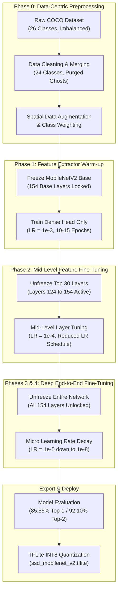

# Multi-Phase Transfer Learning & Unfreezing Workflow for MobileNetV2 SSD

---

## Overview & Figure Citation

**Figure 4.1: The Multi-Phase Transfer Learning and Unfreezing Workflow for the MobileNetV2 SSD Network Architecture** *(Source: "EasyLens Training Notebook" pipeline stages in `docs/training/easylens.ipynb`)*

This document provides both a **Simplified High-Level Architectural Flowchart** and a **Detailed Empirical Engineering Flowchart** illustrating the multi-phase transfer learning, unfreezing strategy, data-centric preprocessing, hyperparameter scheduling, and quantization workflow used to train the EasyLens MobileNetV2 classification model.

---

## 1. Simplified Architectural Flowchart

The high-level pipeline transforms raw imbalanced spatial data into a lightweight, INT8-quantized TFLite edge model via a 4-phase training curriculum:

---

## 2. Detailed Technical & Hyperparameter Pipeline Flowchart

This detailed diagram specifies exact layer blocks, optimizer parameters, learning rates, callbacks, and evaluation checkpoints across each phase of training.

```mermaid
flowchart TB
    subgraph STAGE_0 ["Stage 0: Data-Centric Dataset Engineering"]
        DS_IN["Raw 26-Class COCO Dataset\n(Highly Imbalanced Support)"]
        CLEAN_PROC["Merge Overlapping Categories\nPurge Zero-Support 'Ghost' Classes\nFinal Target: 24 Specialized Classes"]
        CLASS_WGHT["Compute Balanced Class Weights:\nW_c = N_total / (N_classes * N_c)"]
        AUG_PIPE["Data Augmentation Pipeline:\nRandom Horizontal Flip, Rotation (+/- 15°),\nZoom (0.8x-1.2x), Brightness (+/- 20%)"]

        DS_IN --> CLEAN_PROC
        CLEAN_PROC --> CLASS_WGHT
        CLASS_WGHT --> AUG_PIPE
    end

    subgraph STAGE_1 ["Phase 1: Warm-up Head Alignment (Frozen Base)"]
        BASE_LOAD["Load ImageNet Pretrained MobileNetV2 Base\n(Input Shape: 224x224x3 / 300x300x3)"]
        FREEZE_ALL["Freeze All 154 Base Convolutional Layers\n(trainable = False)"]
        ATTACH_HEAD["Attach Custom Dense Classification Head:\n- GlobalAveragePooling2D\n- Dense(256, Activation='relu')\n- Dropout(0.4)\n- Dense(24, Activation='softmax')"]
        COMPILE_P1["Compile Model:\n- Optimizer: Adam (Initial LR = 1e-3)\n- Loss: Categorical Crossentropy\n- Metrics: Accuracy, Top-2, Top-3"]
        TRAIN_P1["Execute Phase 1 Training:\n- Epochs: 10 - 15\n- Train Head Gradients Only\n- Class Weights Active"]

        BASE_LOAD --> FREEZE_ALL
        FREEZE_ALL --> ATTACH_HEAD
        ATTACH_HEAD --> COMPILE_P1
        COMPILE_P1 --> TRAIN_P1
    end

    subgraph STAGE_2 ["Phase 2: Mid-Level Feature Adaption (Top 30 Layers)"]
        UNFREEZE_TOP30["Unfreeze Top 30 MobileNetV2 Layers\n(Unlock Bottleneck Blocks 13-16)\n(Layers 124 - 154 Trainable)"]
        RECOMPILE_P2["Re-compile with Reduced LR:\n- Adam Optimizer (LR = 1e-4)\n- ReduceLROnPlateau (factor=0.5, patience=2)\n- EarlyStopping (patience=5, restore_best)"]
        TRAIN_P2["Execute Phase 2 Training:\n- Epochs: 15 - 20\n- Adapt High-Level Spatial Representations"]

        UNFREEZE_TOP30 --> RECOMPILE_P2
        RECOMPILE_P2 --> TRAIN_P2
    end

    subgraph STAGE_3_4 ["Phases 3 & 4: Deep End-to-End Fine-Tuning"]
        UNFREEZE_ALL["Unfreeze Entire Network Architecture\n(All 154 Layers Trainable)"]
        MICRO_LR["Apply Micro Learning Rate Decay:\n- Phase 3 LR = 1e-5 to 1e-6\n- Phase 4 LR = 1e-7 down to 1e-8\n(Prevents Catastrophic Forgetting)"]
        TRAIN_P34["Execute Deep Fine-Tuning Loops:\n- Fine-tune BatchNorm & Conv Filters\n- Monitor Validation Loss Plateau"]

        UNFREEZE_ALL --> MICRO_LR
        MICRO_LR --> TRAIN_P34
    end

    subgraph STAGE_5 ["Stage 5: Verification, Quantization & Edge Export"]
        EVAL_METRICS["Evaluate Final Model Performance:\n- Top-1 Accuracy: 85.55%\n- Balanced Accuracy: 85.02%\n- Top-2 Accuracy: 92.10%\n- Top-3 Accuracy: 94.54%\n- Inference Latency: 2.48 ms/image (~400 FPS)"]
        TFLITE_CONV["TFLite Converter & INT8 Quantization:\n- Dynamic Range / Post-Training INT8 Quantization\n- Model Footprint Reduction (~75% compression)"]
        DEPLOY["Export Edge Binary:\n`ssd_mobilenet_v2.tflite` -> Integrated into Easylens Flutter Engine"]

        EVAL_METRICS --> TFLITE_CONV
        TFLITE_CONV --> DEPLOY
    end

    AUG_PIPE --> BASE_LOAD
    TRAIN_P1 --> UNFREEZE_TOP30
    TRAIN_P2 --> UNFREEZE_ALL
    TRAIN_P34 --> EVAL_METRICS
```

---

## 3. Detailed Summary of Training Phases

| Training Stage | Unfrozen Layers | Initial Learning Rate (LR) | Key Purpose / Strategy |
| :--- | :--- | :--- | :--- |
| **Phase 0** | N/A (Preprocessing) | N/A | Cleaning 26-class dataset into 24 clean classes, applying spatial data augmentation, and computing balanced class weights. |
| **Phase 1 (Warm-up)** | 0 Layers (Base Frozen) | `1e-3` | Train custom classification head while preserving ImageNet pre-trained feature weights. |
| **Phase 2 (Mid-Tuning)** | Top 30 Layers (124–154) | `1e-4` | Fine-tune high-level inverted residual bottleneck blocks for domain-specific spatial features. |
| **Phase 3 (Deep Tuning)** | All 154 Base Layers | `1e-5` – `1e-6` | End-to-end network optimization with strict LR decay to prevent gradient explosion. |
| **Phase 4 (Micro Tuning)** | All 154 Base Layers | `1e-7` – `1e-8` | Micro-fine tuning to settle loss surface into optimal minima, achieving **85.55% Top-1** and **92.10% Top-2** accuracy. |
| **Export Stage** | Post-Training | Quantization | Convert Keras `.h5`/`.keras` model to `ssd_mobilenet_v2.tflite` for edge deployment (2.48 ms per-frame inference speed). |
