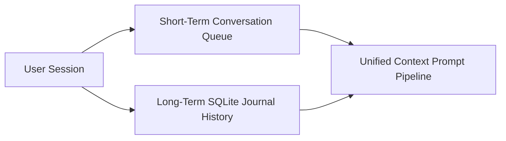
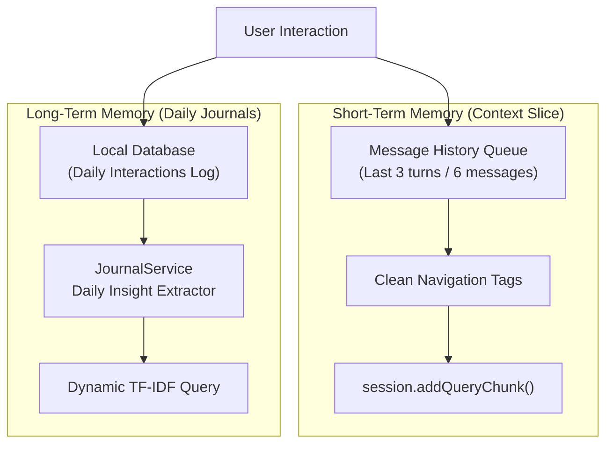
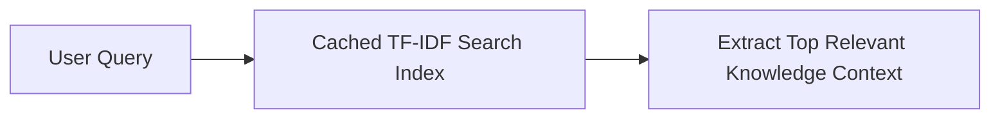
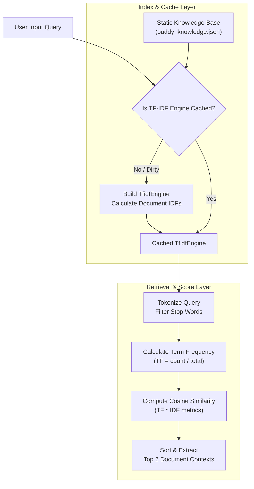
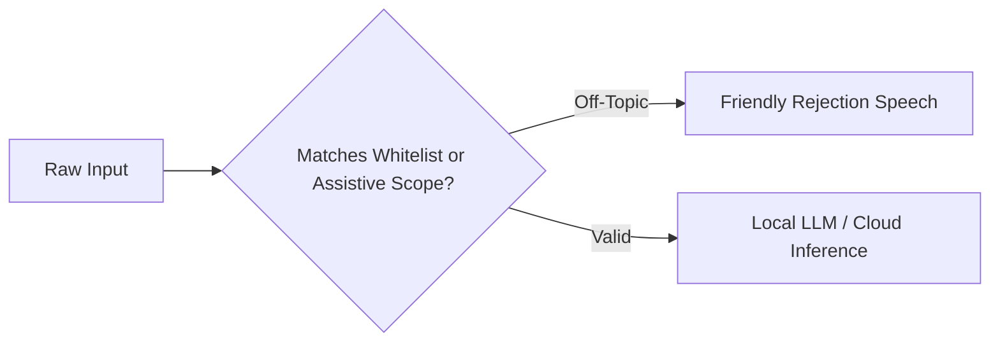
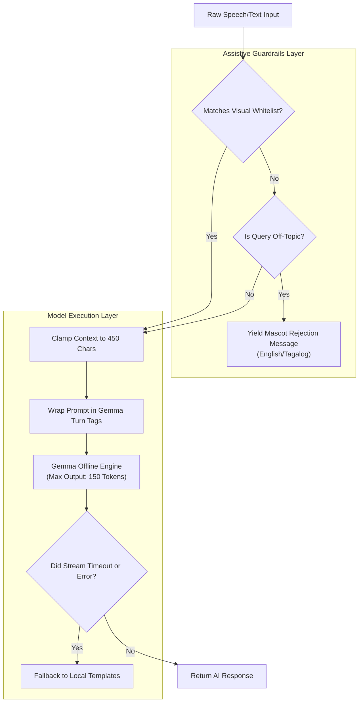

# EasyLens: AI Memory System, TF-IDF Search Index, & Safety Guardrails

This document details the software design, processing loops, retrieval mechanics, and alignment guardrails implemented in the EasyLens AI Assistant (Buddy) to support offline, visual-assistive operations on mobile devices.

---

### 01 — HYBRID AI MEMORY SYSTEM

Buddy maintains a hybrid memory framework to provide both contextual conversation continuity (short-term memory) and historical user awareness (long-term memory).

#### Simplified Memory Overview


#### Detailed Memory Architecture


#### Short-Term Conversational Memory
* **Mechanism**: When chatting with Buddy via the chatbot overlay, the system compiles a conversational context slice of the last 3 back-and-forth turns (up to 6 total messages) from the message stack.
* **Cleaning Pipeline**: Assistant messages in the history are passed through a regular expression filter (`RegExp(r'\[NAVIGATE:[^\]]+\]')`) to strip navigation autopilot tags before being fed back into the model. This prevents Buddy from repeating past routing actions.
* **Gemma Session Feed**: History messages are structured using Gemma turn-based template tags and appended sequentially to the persistent `_gemmaSession` using `Message(text, isUser)` chunks.

#### Long-Term Memory (Journaling)
* **Mechanism**: Every spoken query and assistant response is logged locally to the SQLite-backed [JournalService](file:///Users/arronkianparejas/easylens/lib/services/journal_service.dart).
* **Daily Insights**: A background processor groups interactions by day and runs local summary metrics to extract key insights, user preferences, and frequently mentioned mobility aids.
* **RAG Injector**: During a prompt assembly cycle, the system queries the past 7 days of summaries. Relevant memories are extracted and injected into the prompt context under the header `[Buddy's Memory/Past Journals]`.

#### Unified Memory Architecture
* **Software-Level Unified Knowledge Pool**: The memory database is fully shared between the local Gemma model and the cloud Gemini model. Regardless of model execution routing, both systems query the exact same local SQLite `JournalService` files and `buddy_knowledge.json` index. This guarantees consistent awareness, memory, and mascot identity.
* **Hardware-Level Shared Memory Execution**: Because modern mobile System-on-Chips (Snapdragon/MediaTek on Android, Apple Silicon on iOS) employ a unified memory architecture (where CPU cores and GPU shaders share the same physical RAM pool), loading the local LLM (`model.bin`) does not suffer from high copy or bus overhead. The on-device `flutter_gemma` runner accesses model weights directly within the shared address space, reducing initial load latency.

---

### 02 — LOCAL DATABASE INDEX & TF-IDF SEARCH ENGINE

To perform on-device Retrieval-Augmented Generation (RAG) fully offline, EasyLens implements a Term Frequency-Inverse Document Frequency (TF-IDF) indexing and search engine.

#### Simplified TF-IDF Search Flow


#### Detailed TF-IDF Index & Search Diagram


#### Retrieval Processing Details
1. **Engine Caching**: The static knowledge base ([buddy_knowledge.json](file:///Users/arronkianparejas/easylens/assets/models/buddy_knowledge.json)) contains app feature FAQs, mascot information, HAU campus safety bounds, and object metadata. On first boot, the system instantiates a static `TfidfEngine` and caches it.
2. **Dynamic Journal Indexing**: Because journals are created dynamically, a separate temporary `TfidfEngine` is initialized on-the-fly to index recent journal records.
3. **Similarity Scoring**:
   - The user query is tokenized, and stop-words are discarded.
   - For each matching term, the engine calculates the Term Frequency ($TF = \text{Term Count} / \text{Total Words in Doc}$) and multiplies it by the Inverse Document Frequency ($IDF = \log(1 + \text{Total Docs} / \text{Docs containing Term})$).
   - Document vectors are ranked using Cosine Similarity against the query vector.
4. **Context Constraints**: The top 2 matching contexts are selected. The combined text is clamped to a maximum length of **450 characters** to prevent prompt bloat and keep local LLM latencies under 1 second.

---

### 03 — ASSISTIVE AI SAFETY GUARDRAILS

To prevent the LLM from executing non-assistive computations, hallucinating, or freezing, the RAG and prompt rendering loops employ multiple safety guardrails.

#### Simplified Safety Guardrails Flow


#### Detailed Safety Guardrails Diagram


#### Guardrail Definitions & Implementations

**1. Off-Topic Query Interceptor**
* **Objective**: Bypasses the LLM when users ask general math, coding, or trivia questions, focusing Buddy entirely on visual impairment assistance and navigation.
* **Topic Whitelist Check**: If the query contains any visual/assistive keywords (such as `see`, `look`, `path`, `obstacle`, `nasaan`, `harap`, `mukha`), it is immediately whitelisted and allowed through.
* **Math / Coding / Trivia Blacklist Check**:
  - Math is caught using regular expressions that check for operator symbols between digits (e.g. `1+1`, `2 * 5`) or arithmetic keywords (`calculate`, `solve`, `multiplication`).
  - Programming and trivia queries are caught using keyword sets (e.g. `write code`, `python`, `capital of`, `historical facts`).
* **Mascot Rejection**: If triggered, Buddy immediately bypasses the LLM and returns:
  > *"Woof! I'm designed specifically to assist with visual impairment and navigation. I cannot help with general queries, math, or trivia."* (with equivalent Tagalog translation).

**2. Gemma Turn-Based Prompt Templates**
* **Objective**: Prevents Gemma-IT from running out of bounds, hallucinating, or generating user prompts.
* **Structure**: All queries sent to on-device Gemma are wrapped in the formal instruction-tuned template:
  ```text
  <start_of_turn>user
  Instruction: [System Prompt]
  
  [Context (RAG + Memories)]
  [User Question]
  <end_of_turn>
  <start_of_turn>model
  ```
* **Tag Stripper**: Any trailing control tags generated by the LLM (like `<end_of_turn>` or `<start_of_turn>model`) are automatically stripped before passing the text to `TtsService`.

**3. Output Token Ceiling**
* **Objective**: Reduces execution latency and prevents battery drain.
* **Mechanism**: Both the pre-initialization warm-up and the active model calls are locked at `maxTokens: 150`. This limits the computation slice, keeping model processing fast even on older mobile GPUs/CPUs.

**4. Cloud Fallback Recovery Loop**
* **Objective**: Guarantees app availability under unstable networking or authentication issues.
* **Mechanism**: If `useLocalAI` is disabled and the online Gemini stream experiences network drops or key validation errors, `askBuddyStream` catches the error, immediately breaks the loop, and yields a locally compiled template response (`generateSmartLocalResponse(rawQuestion)`).
