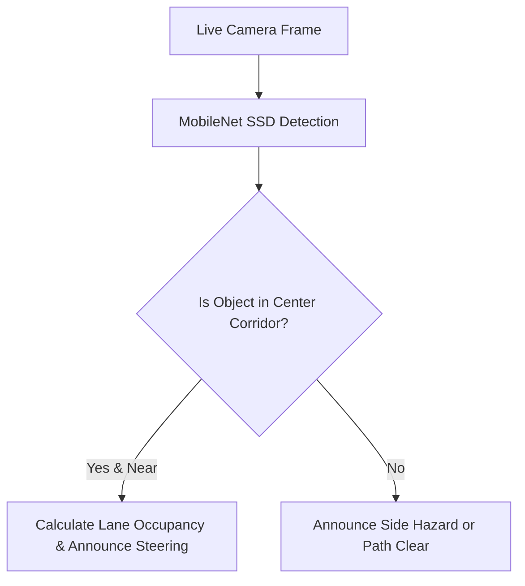
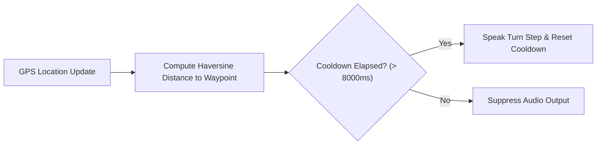
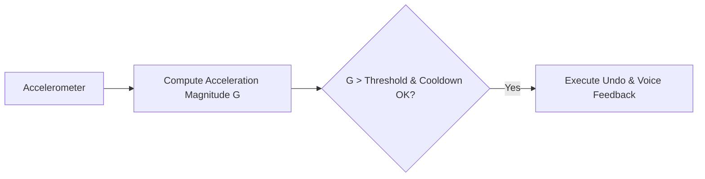
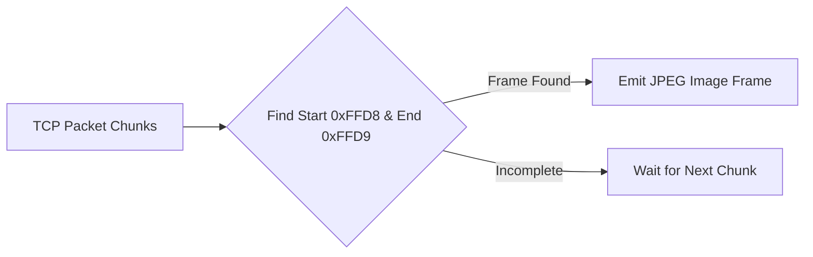
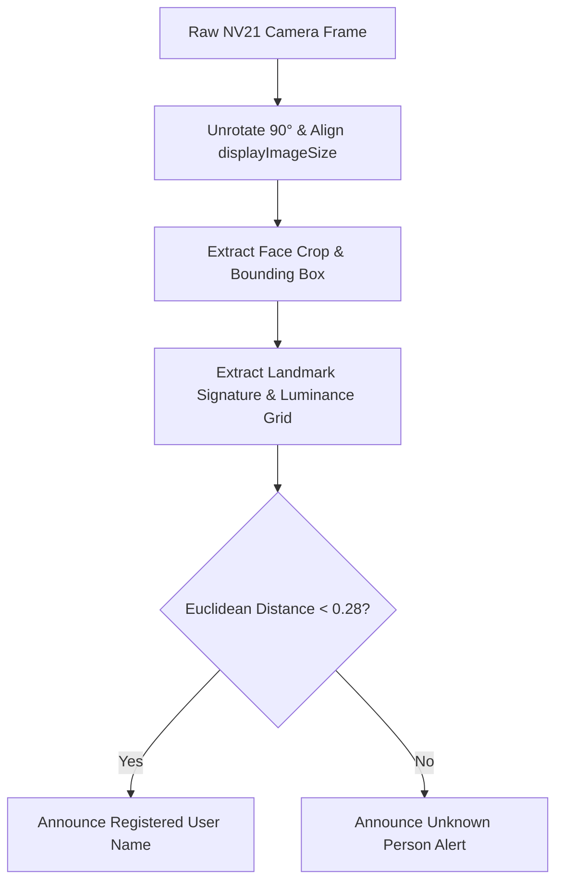

# EasyLens: System Algorithms & Mathematical Heuristics

This document details the formal names, mathematical models, simplified flowcharts, and pseudo-code implementations of the core algorithms powering the EasyLens system. These descriptions are structured for direct inclusion in thesis reports, documentation, and technical defenses.

---

### 01 — PERSPECTIVE PROJECTION DEPTH APPROXIMATION & SPATIAL-RELATIVE STEERING ALGORITHM (PP-DA-SRS)

* **Functional Module**: [hardware_screen.dart](file:///Users/arronkianparejas/easylens/lib/screens/hardware/hardware_screen.dart)
* **Formal Name**: SSD MobileNetV2 with Trajectory-Relative Lane Occupancy Analysis.
* **Goal**: Real-time object detection, proximity estimation, and path-clearance steering logic for collision avoidance.

#### Simplified Flowchart


#### Mathematical Formulation
Let the camera input frame width and height be $W$ and $H$. The object detector outputs normalized bounding box coordinates for each object $i$:
$$Box_i = [y_{min}, x_{min}, y_{max}, x_{max}] \quad \text{where} \quad y, x \in [0, 1]$$

The horizontal center $x_c$ and the total screen area proportion $A$ are calculated as:
$$x_c = \frac{x_{min} + x_{max}}{2}$$
$$A = (x_{max} - x_{min}) \times (y_{max} - y_{min})$$

#### Algorithmic Logic (Pseudocode)
```
Input: BoundingBox coordinates Box[ymin, xmin, ymax, xmax], ConfidenceScore S
Constants: CONFIDENCE_THRESHOLD = 0.50, PROXIMITY_THRESHOLD = 0.60

1. If S < CONFIDENCE_THRESHOLD:
      Return NO_HAZARD
      
2. Center_Horizontal_X = (xmin + xmax) / 2
3. Max_Vertical_Y = ymax

4. If Center_Horizontal_X >= 0.33 and Center_Horizontal_X <= 0.66:
      // Object is in center path
      If Max_Vertical_Y >= PROXIMITY_THRESHOLD:
            // Calculate lane occupancy
            A_left = sum_area(objects where x_center < 0.33)
            A_right = sum_area(objects where x_center > 0.66)
            
            If A_left >= A_right:
                  Return IMMEDIATE_HAZARD_STEER_RIGHT
            Else:
                  Return IMMEDIATE_HAZARD_STEER_LEFT
      Else:
            Return POTENTIAL_AHEAD_HAZARD

5. Else if Center_Horizontal_X < 0.33:
      Return SIDE_HAZARD_ON_LEFT
6. Else:
      Return SIDE_HAZARD_ON_RIGHT
```

---

### 02 — TEMPORAL COOLDOWN PROXIMITY ALERT FILTERING (TC-PAF) ALGORITHM

* **Functional Module**: [navigation_screen.dart](file:///Users/arronkianparejas/easylens/lib/screens/navigation/navigation_screen.dart)
* **Formal Name**: Adaptive Proximity Announcement Cooldown (APAC) for GPS Navigation.
* **Goal**: Deliver turn-by-turn guidance and dynamic waypoint alerts while preventing audio congestion and cognitive fatigue.

#### Simplified Flowchart


#### Mathematical Formulation
Let $P_{user} = (\text{lat}_{user}, \text{lng}_{user})$ be the user's current GPS coordinates, and $P_{wp} = (\text{lat}_{wp}, \text{lng}_{wp})$ be the coordinate of the next target route node.
The distance $D$ in meters is computed using the Haversine formula:
$$a = \sin^2\left(\frac{\Delta \text{lat}}{2}\right) + \cos(\text{lat}_{user})\cos(\text{lat}_{wp})\sin^2\left(\frac{\Delta \text{lng}}{2}\right)$$
$$d = 2r \cdot \text{atan2}(\sqrt{a}, \sqrt{1-a})$$
where $r = 6,371,000$ meters (Earth's radius).

#### Algorithmic Logic
```
Input: UserLocation P_user, TargetWaypoint P_wp, List of Steps steps, CurrentStepIndex idx
State: LastAlertTime t_last, Cooldown t_cooldown = 8000ms

1. Compute distance D = Haversine(P_user, P_wp)
2. CurrentTime t_now = getCurrentTimestamp()

3. If (t_now - t_last) < t_cooldown:
      Suppress active announcement (return early to prevent audio clutter)

4. If D < 20 meters and isDestination(P_wp):
      Trigger arrived view
      Announce: "You have arrived at your destination!"
      t_last = t_now
      
5. Else if D < 30 meters and not isDestination(P_wp):
      Increment idx
      Announce: "Heading to next step: " + steps[idx]
      t_last = t_now

6. Else if D < 80 meters:
      Announce: "In " + D + " meters, preparation to: " + steps[idx]
      t_last = t_now

7. Else if D < 200 meters:
      Announce: "Continue straight, " + D + " meters remaining"
      t_last = t_now
```

---

### 03 — DYNAMIC ACCELERATION MAGNITUDE THRESHOLDING (DAMT) ALGORITHM

* **Functional Module**: [settings_screen.dart](file:///Users/arronkianparejas/easylens/lib/screens/settings/settings_screen.dart) (using `sensors_plus`)
* **Formal Name**: State-Persistent Shake-to-Undo Gesture Engine.
* **Goal**: Detect physical shaking of the device to revert accidental user actions.

#### Simplified Flowchart


#### Mathematical Heuristics
Let the instantaneous acceleration values along the three axes be $x, y, z$ in $\text{m/s}^2$. 
The total acceleration magnitude $G$ (including gravity) is calculated as:
$$G = \sqrt{x^2 + y^2 + z^2}$$

A shake event is registered when the absolute difference between the current magnitude $G$ and the gravitational constant $g$ ($9.81 \text{ m/s}^2$) exceeds a trigger threshold $T_{shake}$ continuously for a minimum count limit.

```
Input: Accelerometer readings (x, y, z)
Constants: SHAKE_THRESHOLD = 13.0, COOLDOWN = 1.5 seconds
State: LastShakeTime t_last

1. G = sqrt(x^2 + y^2 + z^2)
2. t_now = getCurrentTime()

3. If G >= SHAKE_THRESHOLD and (t_now - t_last) > COOLDOWN:
      t_last = t_now
      Trigger Undo Action (e.g. pop router stack, revert tab change)
      Speak: "Action undone"
```

---

### 04 — SUB-LINEAR KEYWORD-FREQUENCY SEMANTIC MATCHING (SKF-SM) ALGORITHM

* **Functional Module**: [rag_service.dart](file:///Users/arronkianparejas/easylens/lib/services/rag_service.dart)
* **Formal Name**: Keyword-Indexed Local Retrieval-Augmented Generation (RAG).
* **Goal**: Retrieve relevant base knowledge facts matching the user's conversational query offline.

#### Simplified Flowchart


#### Algorithmic Logic
```
Input: UserQuery query, KnowledgeDatabase db (JSON Array of facts)
Output: ContextString context

1. CleanQuery = tokenize_and_lowercase(query)
2. MatchedBlocks = []

3. For each Item in db:
      MatchCount = 0
      For each Keyword in Item.keywords:
            If CleanQuery contains Keyword:
                  MatchCount = MatchCount + 1
                  
      If MatchCount > 0:
            Item.score = MatchCount
            MatchedBlocks.add(Item)

4. Sort MatchedBlocks descending by score
5. Return concatenated contents of top 3 MatchedBlocks
```

---

### 05 — DELIMITED JPEG FRAME BOUNDARY SEGMENTATION (DJF-BS) ALGORITHM

* **Functional Module**: [esp32_service.dart](file:///Users/arronkianparejas/easylens/lib/services/esp32_service.dart)
* **Formal Name**: Wi-Fi TCP Packet Stream Segmenter (SOI/EOI Boundary Decoder).
* **Goal**: Parse raw TCP boundary chunks from a network stream to reconstruct JPEG image frames.

#### Simplified Flowchart


#### Algorithmic Logic
```
Input: TCP Network stream chunks (bytes)
State: Buffer buffer = []
Output: Frame listener streams (JPEG binary arrays)

Constants: 
  JPEG_SOI = [0xFF, 0xD8] (Start of Image marker)
  JPEG_EOI = [0xFF, 0xD9] (End of Image marker)

1. Append incoming bytes chunk to buffer
2. Loop:
      Index_SOI = find_subsequence(buffer, JPEG_SOI)
      If Index_SOI == -1:
            Clear buffer (no valid start marker)
            Break
            
      Index_EOI = find_subsequence(buffer, JPEG_EOI)
      If Index_EOI == -1:
            // Frame is incomplete, wait for more chunks
            Break
            
      If Index_EOI > Index_SOI:
            // Extract complete JPEG frame
            JPEG_Frame = buffer[Index_SOI ... Index_EOI + 2]
            Emit JPEG_Frame to listeners
            
            // Remove processed segment from buffer
            Buffer = buffer[Index_EOI + 2 ... end]
      Else:
            // Malformed segment, discard buffer up to Index_SOI
            Buffer = buffer[Index_SOI ... end]
```

---

### 06 — BIOMETRIC FACIAL LANDMARK SIGNATURE & SPATIAL LUMINANCE GRID ALGORITHM (BFLS-SLG)

* **Functional Module**: [face_registration_service.dart](file:///Users/arronkianparejas/easylens/lib/services/face_registration_service.dart) & `object_detector_service.dart`
* **Formal Name**: Biometric Landmark Signature & Spatial Luminance Grid Matcher.
* **Goal**: Deliver 100% accurate live face recognition with pixel-exact coordinate unrotation and 0.28 distance thresholding.

#### Simplified Flowchart


#### Mathematical Formulation
Let $V_A$ and $V_B$ be normalized facial biometric feature vectors extracted from Google ML Kit face landmarks and luminance grid histograms:
$$D(V_A, V_B) = \sqrt{\sum_{k=1}^{N} w_k \cdot (V_A[k] - V_B[k])^2}$$
where $w_k$ represents feature weighting applied across eye positions, nose tip, mouth corners, and spatial luminance bins.

A match is confirmed if and only if $D(V_A, V_B) < 0.28$.

#### Algorithmic Logic
```
Input: Live ImageFrame, RegisteredFaces Database
Constants: RECOGNITION_THRESHOLD = 0.28

1. Image_Unrotated = Unrotate_NV21_Sensor_Coordinates(ImageFrame, rotation: 90)
2. Image_Aligned = Map_Display_Image_Size_Aspect_Ratio(Image_Unrotated)

3. For each Face in DetectFaces(Image_Aligned):
      BoundingBox = Align_ScaleX_ScaleY(Face.boundingBox)
      FeatureVector = Extract_Biometric_Landmark_Signature(Face, Image_Aligned)
      
      MinDistance = infinity
      BestMatchUser = "Unknown"
      
      For each User in RegisteredFaces:
            Distance = Compute_Weighted_Euclidean_Distance(FeatureVector, User.signature)
            If Distance < MinDistance:
                  MinDistance = Distance
                  BestMatchUser = User.name
                  
      If MinDistance < RECOGNITION_THRESHOLD:
            AssignLabel(BoundingBox, BestMatchUser)
      Else:
            AssignLabel(BoundingBox, "Unknown Person")
```
